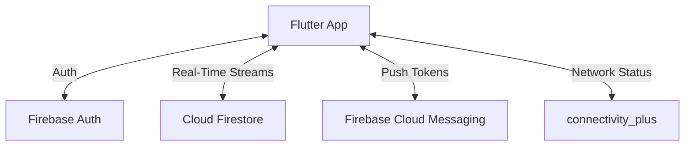
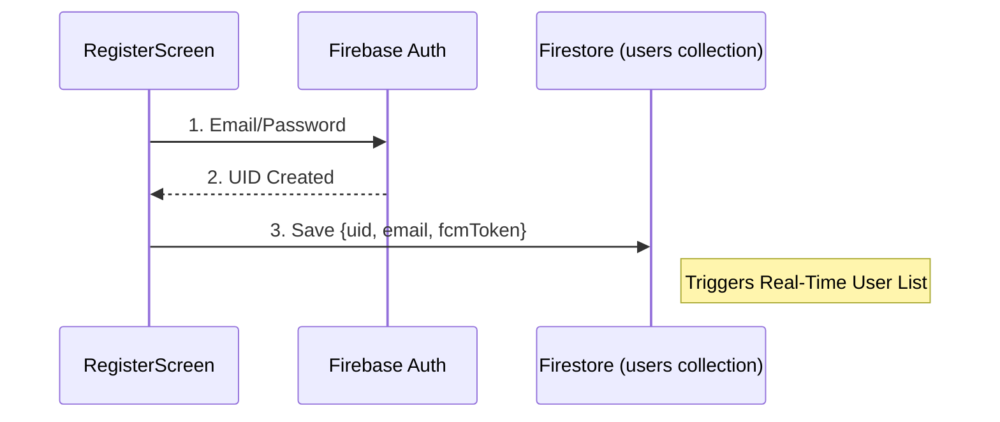
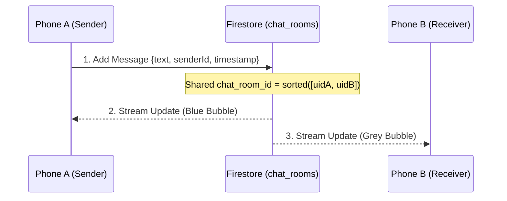
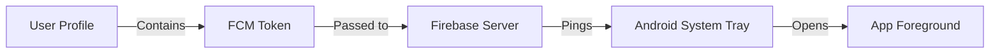
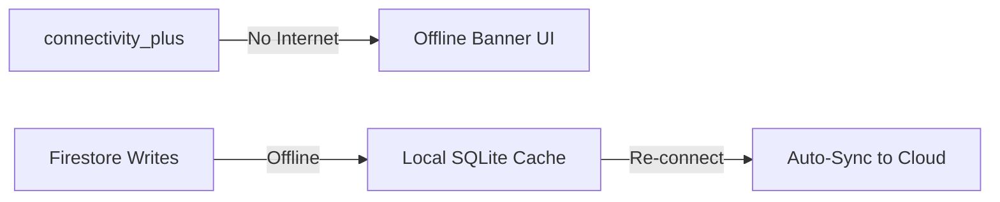

# Data Flow Architecture

This document explains exactly how data moves through your Real-Time Messaging App, from the user's phone to the cloud and back.

## 1. High-Level Data Map

---

## 2. Authentication & User Profile Flow
When a user registers or logs in, their identity is synced across the system.

- **Key Logic**: Found in `lib/screens/register_screen.dart` and the `AuthWrapper` in `lib/main.dart`.
- **Impact**: Any change in the `users` collection instantly updates the Home Screen for every other user.

---

## 3. Real-Time Messaging Flow
Messaging is built on shared "Chat Rooms" in Firestore.

- **Room Logic**: `_getChatRoomId` in `lib/screens/chat_screen.dart` ensures both users land in the same private collection.
- **Auto-Sync**: Uses `StreamBuilder` so messages appear without an "Inbox Refresh."

---

## 4. Push Notification Data Flow
How the app pings you when it's closed.

- **Key Logic**: `FirebaseMessaging.instance.getToken()` in `main.dart` captures the unique phone ID.
- **Handling**: `_firebaseMessagingBackgroundHandler` handles messages when the app is completely closed.

---

## 5. Offline & Recovery Flow
The app is designed to work without Wi-Fi using local caching.

- **Persistence**: FlutterFirestore has "Offline Persistence" enabled by default on mobile.
- **UX**: The `OfflineBanner` widget in `lib/widgets/offline_banner.dart` warns the user while the caching logic manages the data.
